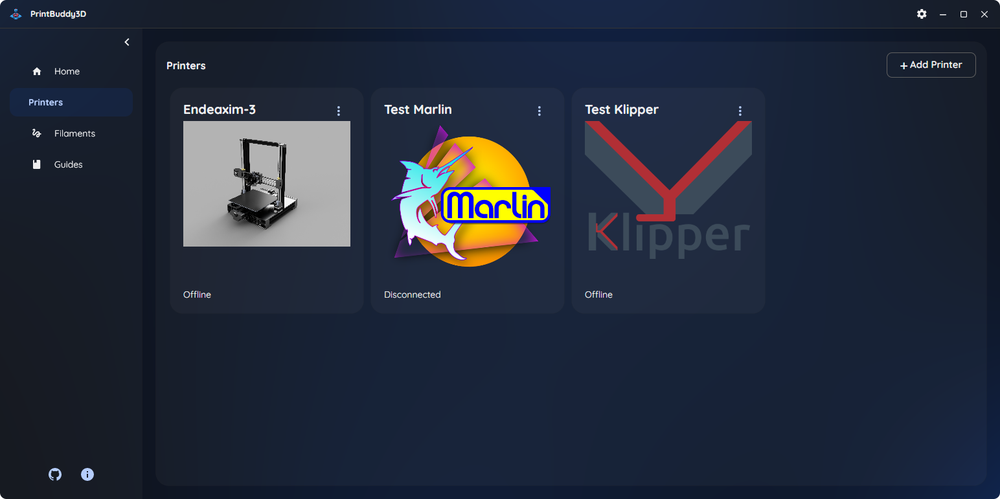
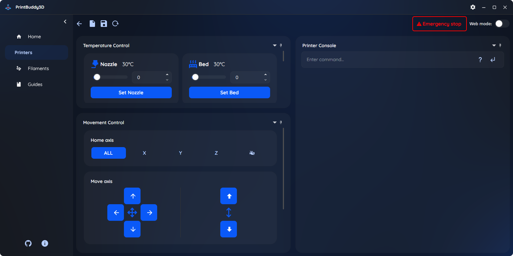

<h1> 
PrintBuddy3D
 </h1>
Your all-in-one 3D printer companion app for managing assembly guides, troubleshooting, and remote control.

# Overview
## 🚀 Main features
- Recieve notification on home screen.
- Controling klipper and marlin printers.
- SSH into klipper printer.
- Webmode as fallback if widgets fails for klipper printers.
- Adding filament and automatically track it.
- Custom layout with docking system for control widgets inside the app.

---
# 🔨 Instalation
## Windows
`Dependencies: WebView2`

## Linux
`Dependencies: libgtk-3 and libwebkit2gtk-4.1`
>[!NOTE]
>Use this app with x11. Otherwise the app will crash because of the current implement of GtkWebView. This will probably be resolved in the future.

# ⚠️ Work in progress
- This project is currently in developing. Features will be implemented will be implemented as soon as possible.
## ✅ Working features
- [x] Recieve notification on home screen.
- [x] Get printer status. (online/offline/printing/...)
- [x] Add klipper printers and connect to them.
- [x] SSH into klipper printer on Windows.
- [x] Moving axis on klipper printers.
- [x] Set tempeature on klipper printers.
- [x] Send commands using console to klipper printers.
- [x] Webmode as fallback if widgets fails for klipper printers.
- [x] Adding filament and manually update it.
- [x] Docking system for control widgets inside the app.
## ⚒️ Features in development
- [ ] Connect to the marlin printers.
- [ ] Get printer info. (axis position, tempeature, etc.)
- [ ] Working SSH on linux.
- [ ] Automatic fillament tracking.
- [ ] Adding widgets for controlling printer.
- [ ] Send print jobs.
- [ ] Documentation inside app. (basic troubleshooting, etc.)

# 🛠️ Maintenance and Support
- If you encounter bugs or need help, make a request here on git at issues.

# 🌟 Acknowledgements
- Thank you for using PrinBuddy3D! We appreciate your support and hope that the application will make it easier for you to manage your 3D printers.
