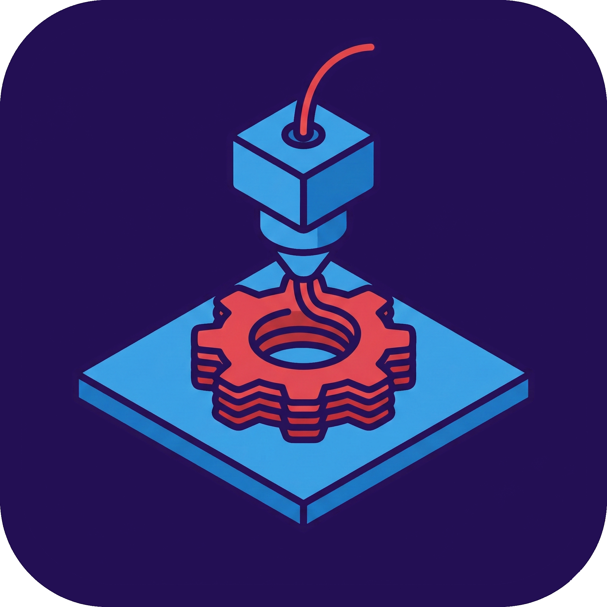

<h1> 
PrintBuddy3D
 </h1>
3D printer app for remote control, tracking filament and managing assembly guides.

# Overview
## 🚀 Main features
- Receive notification on home screen.
- Controlling klipper and marlin printers.
- SSH into klipper printer.
- Adding filament and automatically track it.
- Custom layout with docking system for control widgets inside the app.

---
# 🔨 Installation
## Windows
- Will be in exe format soon.
- For now, you can build it from source code. (see [Contributing](./CONTRIBUTING.md))

## Linux
- Will be in flatpak soon.
- For now, you can build it from source code. (see [Contributing](./CONTRIBUTING.md))

# ⚠️ Work in progress
- This project is currently in developing. Features will be implemented will be implemented as soon as possible.
## ✅ Working features
- [x] Receive notification on home screen.
- [x] Get printer status. (online/offline/printing/...)
- [x] Add klipper printers and connect to them.
- [x] SSH into klipper printer on Windows and Linux. 
- [x] Moving axis on klipper printers.
- [x] Set temperature on klipper printers.
- [x] Send commands using console to klipper printers.
- [x] Adding filament and manually update it.
- [x] Docking system for control widgets inside the app.
- [x] Documentation inside app. (basic troubleshooting, etc.)
  - needs to be finished on github wiki
- [x] Connect to the marlin printers.

## ⚒️ Features in development
- [ ] Get printer info. (axis position, temperature, etc.)
- [ ] Automatic fillament tracking.
- [ ] Adding widgets for controlling printer.
- [ ] Send print jobs.

# 🛠️ Maintenance and Support
- If you encounter bugs or need help, make a request here on git at issues.

# 🌟 Acknowledgements
- Thank you for using PrintBuddy3D! We appreciate your support and hope that the application will make it easier for you to manage your 3D printers.
